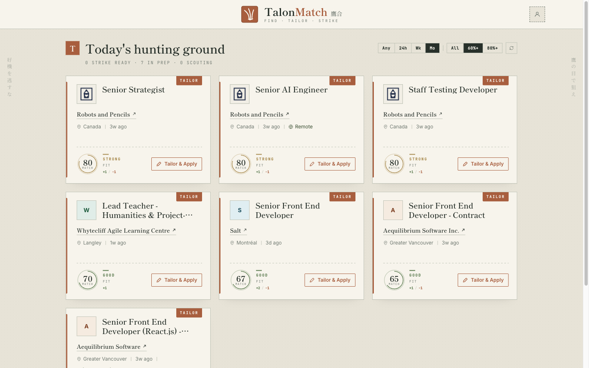
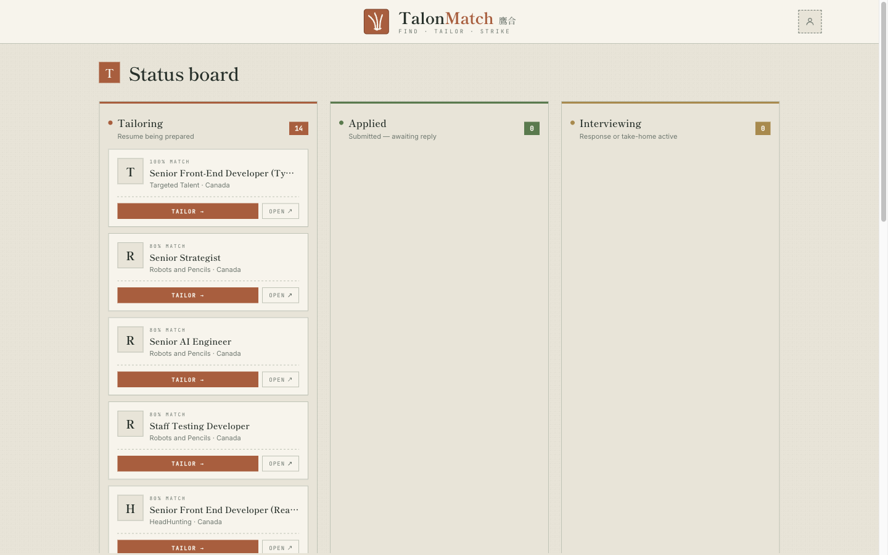
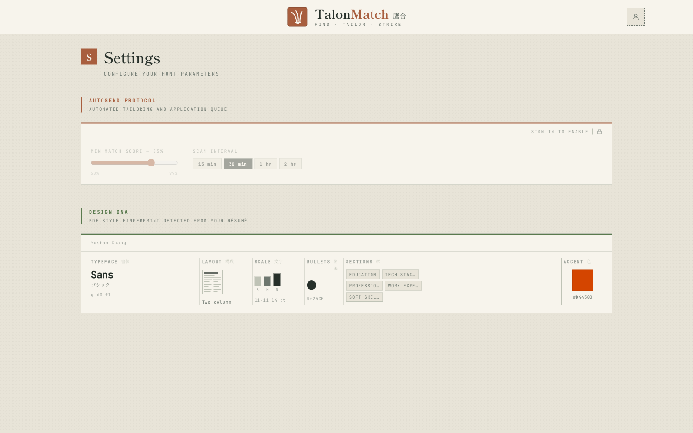
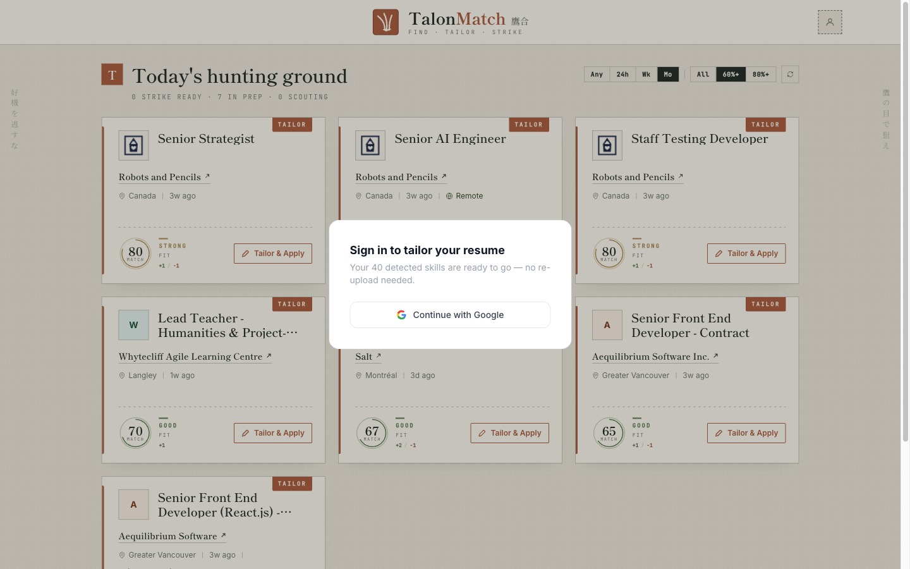

# TalonMatch

AI-powered job matching and resume tailoring. Upload your resume, get ranked job matches with skill gap analysis, and tailor your resume to any listing in a single LLM pass.

> **Portfolio project.** No live demo — screenshots below. Run locally with your own API keys.

---

## Screenshots

**Job feed** — ranked matches with skill delta and match score


**Kanban board** — track applications across Tailoring / Applied / Interviewing


**Settings — Design DNA** — PDF style fingerprint (typeface, layout, accent color) extracted from your resume


**Auth gate** — guest users prompted to sign in before tailoring


---

## Features

- **Resume parsing** — Groq LLM extracts 40+ granular skills from uploaded PDF
- **Job matching** — aggregates listings from Remotive + Adzuna, scores and ranks by skill overlap
- **Skill delta** — per-card display of matching vs. missing skills, score capped at 99% when gaps exist
- **Resume tailoring** — single-pass Groq call rewrites summary, bullets, and projects to match the JD; zero hallucination (no invented metrics or titles)
- **Auth** — Google OAuth via Supabase; guest flow preserved across redirect with localStorage
- **Career ladder expansion** — searches next-level titles alongside resume titles automatically

## Tech Stack

| Layer        | Technology                                   |
| :----------- | :------------------------------------------- |
| Frontend     | React 19, Vite, Tailwind CSS v4, Motion/React |
| Backend      | Node.js, Express                             |
| Auth/DB      | Supabase (PostgreSQL + Google OAuth)         |
| AI           | Groq (`llama-3.1-8b-instant`)                |
| Job APIs     | Remotive, Adzuna                             |

## Local Setup

**Prerequisites:** Node 20+, a [Groq API key](https://console.groq.com), a [Supabase](https://supabase.com) project.

```bash
# 1. Clone
git clone https://github.com/YushanC00/job-search-app.git
cd job-search-app

# 2. Backend
cd backend
cp .env.example .env          # fill in GROQ_API_KEY
npm install
npm run dev                   # http://localhost:3001

# 3. Frontend (new terminal)
cd frontend
cp .env.example .env.local    # fill in Supabase URL + anon key
npm install
npm run dev                   # http://localhost:5173
```

Both servers must run together. Frontend proxies `/api/*` to `localhost:3001`.

## Architecture

```
backend/
  server.js          Express + routes
  resumeParserAI.js  Groq → structured resume (skills, experience, projects)
  jobFetcher.js      Remotive + Adzuna aggregation, file cache, dedup
  matchScorer.js     Token-based skill scoring with seniority cross-domain guards
  tailorResume.js    Single-pass Groq tailoring, strict JSON schema output

frontend/src/
  App.tsx            Global state: auth, parsedResume, displayJobs
  components/
    JobCard          Animated cards, skill delta, single-action button
    TailoredResumeDrawer  Diff view with Accept/Cancel per bullet
    ResumeUpload     PDF drop zone
    UserMenu         Guest + authenticated modes
```

## Design Constraints

- 0px border-radius everywhere (design rule)
- `tm-mincho` for headings, `tm-mono` for all technical data and buttons
- Score never shown as 100% when required skills are missing
- All tailoring in one LLM round-trip — no sequential calls
